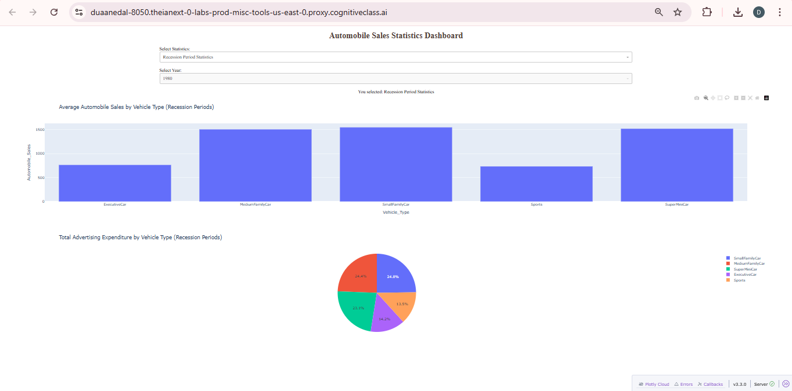
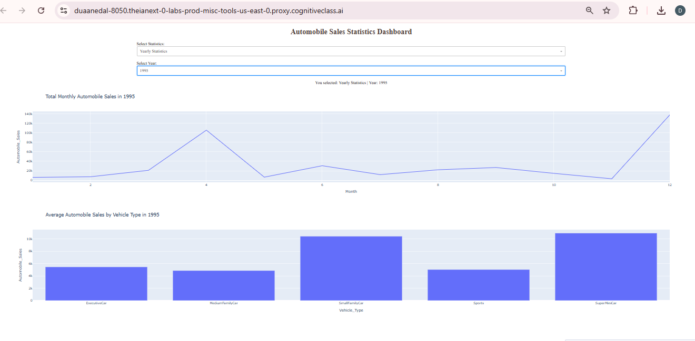

# Automobile Sales Analysis and Dashboard

[](https://colab.research.google.com/drive/1jFOjL5jhkXNrfIPCL0dkguYfv0q4qsO4?usp=sharing)

This repository contains an end-to-end data analysis and visualization project focused on historical automobile sales data.  
The project analyzes the impact of recession periods on automobile sales and advertising expenditure and presents insights through an interactive dashboard built with Plotly and Dash.

---

## 📂 Project Contents

- **Part 1 – Data Analysis (Google Colab)**
  - Exploratory Data Analysis (EDA)
  - Comparison between recession and non-recession periods
  - Insights by vehicle type

- **Part 2 – Interactive Dashboard (Plotly & Dash)**
  - Recession Period Statistics
  - Yearly Statistics by selected year
  - Interactive visualizations

---

## 📘 Part 1: Data Analysis (Google Colab)

The first part of the project focuses on exploratory data analysis (EDA) to understand automobile sales trends during recession and non-recession periods.

### Key Analysis:
- Sales comparison during recession vs non-recession periods
- Sales performance across different vehicle types
- Business insights based on economic conditions

### Tools Used:
- Python
- Pandas
- Plotly / Matplotlib

👉 **Open the analysis notebook in Google Colab:**  
https://colab.research.google.com/drive/1jFOjL5jhkXNrfIPCL0dkguYfv0q4qsO4?usp=sharing

---

## 📊 Part 2: Interactive Dashboard (Plotly & Dash)

The second part of the project is an interactive dashboard that allows users to visually explore automobile sales data.

### Dashboard Features:
- **Recession Period Statistics**
  - Average automobile sales by vehicle type
  - Distribution of advertising expenditure by vehicle type
- **Yearly Statistics**
  - Total monthly automobile sales for a selected year
  - Average automobile sales by vehicle type for a selected year

### Technologies Used:
- Python
- Dash
- Plotly
- Pandas
  



---

## ▶️ How to Run the Dashboard Locally

1. Clone the repository:
```bash
git clone https://github.com/duaabn/automobile-sales-dashboard.git

